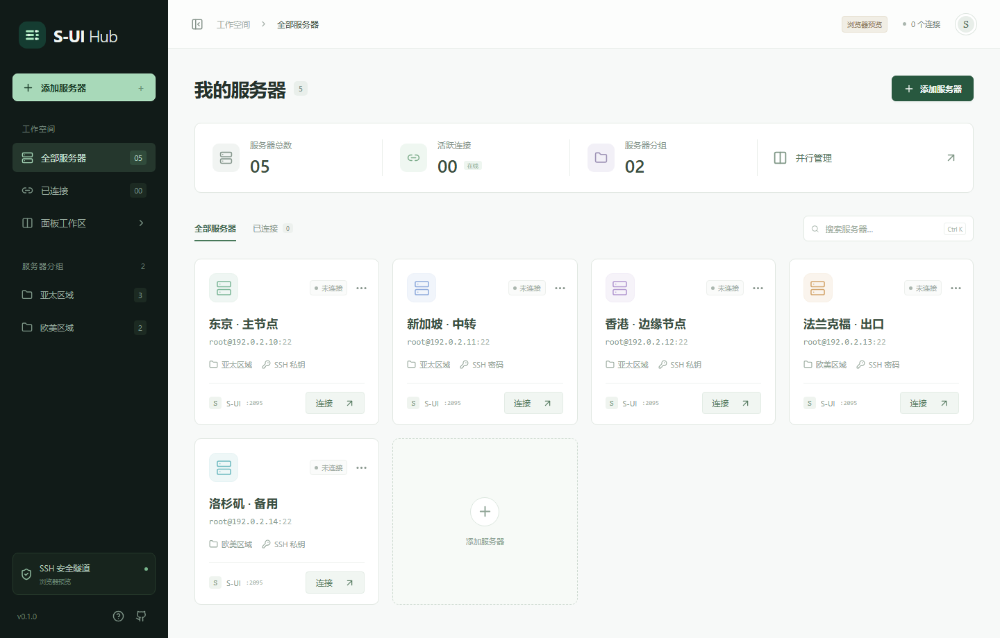

# S-UI Hub

在一个桌面工作区同时管理多台服务器的 [S-UI](https://github.com/alireza0/s-ui) 面板。



## 功能

- 进行服务器 S-UI 面板配置和端口转发。
- 添加服务器时可选自动初始化 S-UI / realm。
- S-UI配置支持单面板、左右分屏、上下分屏、四宫格。
- 独立配置 S-UI 账号密码，支持自动登录和凭证重置。
- 全局语言与主题设置可同步到内嵌 S-UI 面板。

## 开发

需要 Node.js 22+、Rust stable，以及所在平台的 [Tauri 依赖](https://v2.tauri.app/start/prerequisites/)。

```bash
npm ci
npm run tauri dev
```

仅预览界面：`npm run dev`，打开 `http://127.0.0.1:15420`

```bash
npm run check
npm test
python tests/remote_scripts_test.py
npm run build
npx playwright install chromium
npm run test:e2e
cargo test --manifest-path src-tauri/Cargo.toml --locked
npm run tauri build
```

## 平台与发布

| 平台          | 构建架构             | 安装包                      |
| ------------- | -------------------- | --------------------------- |
| Windows 10/11 | x64                  | NSIS `.exe`、`.msi`         |
| macOS 14+     | Apple Silicon、Intel | `.dmg`                      |
| Linux         | x64、ARM64           | `.deb`、`.rpm`、`.AppImage` |

## License

[MIT](LICENSE)
